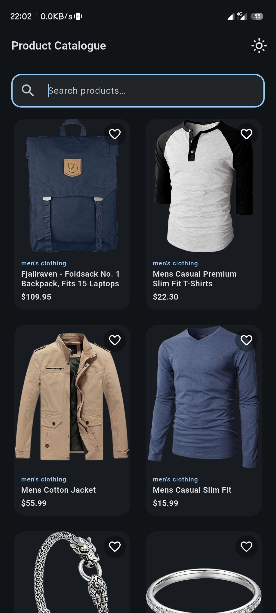
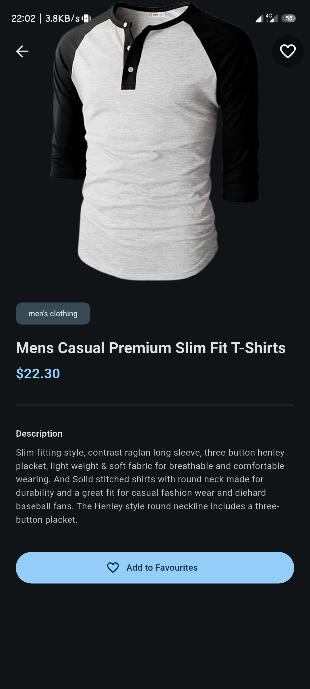
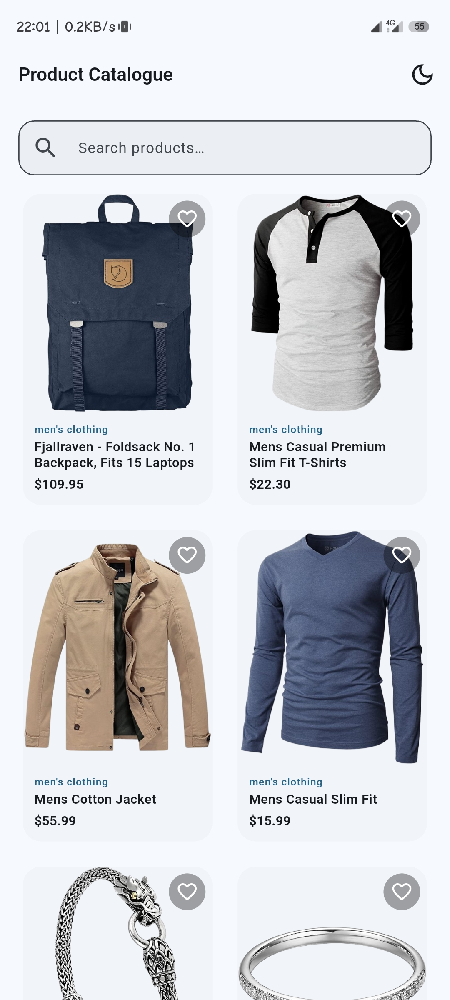
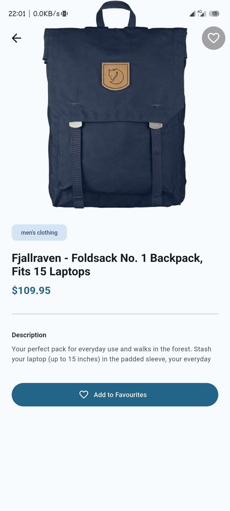
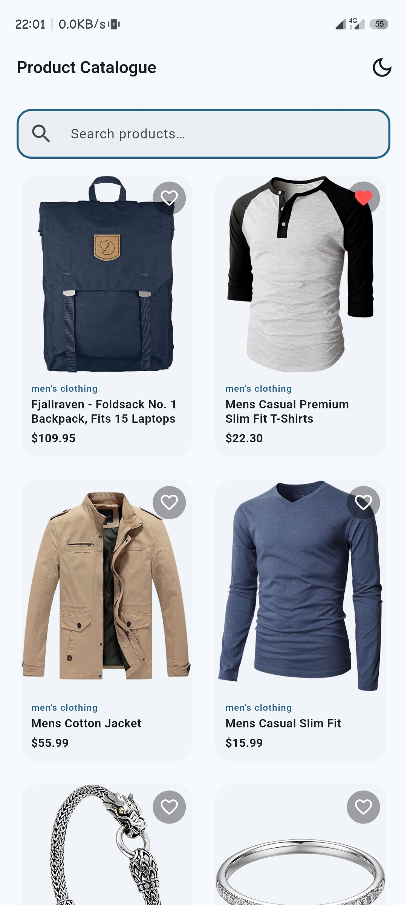
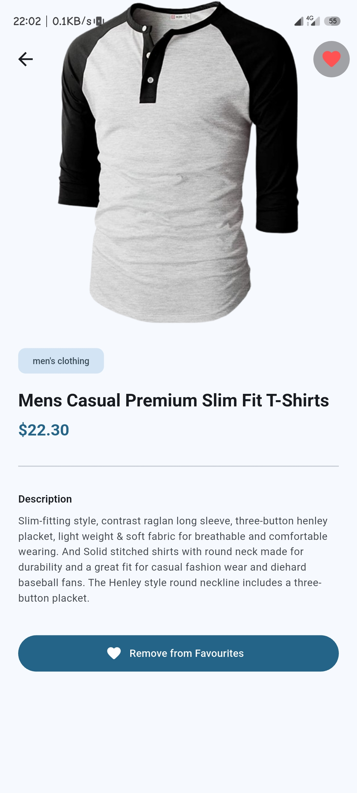
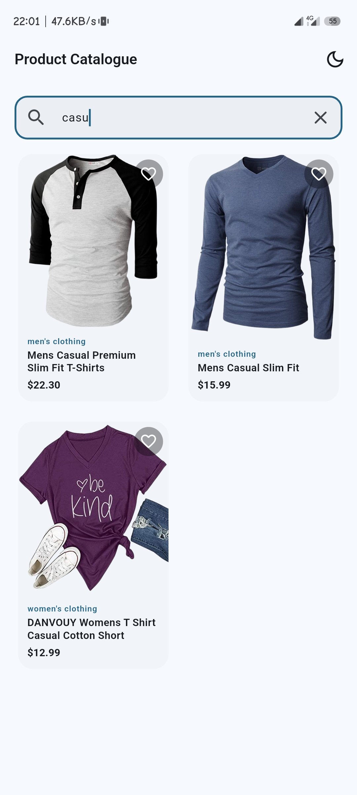

# Product Catalogue

A small Flutter product catalogue app built as a practical assessment. Users can browse products, search by name, view full details, and mark items as favourites — with the favourite list persisted across app restarts.

## Project Overview

The app has two screens:

- **Product List** — a two-column grid of products (image, name, price, category, favourite button) with a live search field, pull-to-refresh, and loading/error/empty states.
- **Product Details** — a larger image, full description, price, category, and a favourite toggle that stays in sync with the list screen.

Product data comes from a real public API — [FakeStoreAPI](https://fakestoreapi.com) — fetched over HTTP, not hardcoded.

## Setup Instructions

### Prerequisites
- Flutter SDK (3.22+ recommended; the project targets Dart `>=3.3.0`)
- An Android emulator/device (or `flutter build apk` for a standalone APK)
- Internet access at runtime (the app fetches live data from FakeStoreAPI)

### 1. Get platform folders (first time only)

This repo ships only the Dart source (`lib/`), `pubspec.yaml`, tests, and config — no generated `android/`/`ios/` folders, since those are machine-generated and best created by your local Flutter SDK version. From the project root:

```bash
flutter create .
```

This adds the missing `android/`, `ios/`, etc. folders without touching existing files. If your Flutter version prompts about overwriting `lib/main.dart` or `pubspec.yaml`, answer **no** — or simply run `git checkout -- lib pubspec.yaml` afterwards to be safe.

### 2. Install dependencies

```bash
flutter pub get
```

### 3. Run the project

```bash
flutter run
```

### 4. Build an APK

```bash
flutter build apk --release
```

The output APK will be at `build/app/outputs/flutter-apk/app-release.apk`.

### 5. Run tests (optional)

```bash
flutter test
```

## Architecture

### Folder structure

```
lib/
  main.dart                        # entry point
  app.dart                         # MaterialApp + provider wiring
  models/
    product.dart                    # Product data model
  data/
    product_repository.dart         # fetches from FakeStoreAPI over HTTP
  providers/
    product_provider.dart           # load status, product list, search
    favourites_provider.dart        # favourite IDs + persistence
    theme_provider.dart             # light/dark mode + persistence
  theme/
    app_theme.dart                  # shared light/dark ThemeData
  screens/
    product_list_screen.dart
    product_details_screen.dart
  widgets/
    product_card.dart
    product_image.dart
    loading_view.dart
    error_view.dart
    empty_view.dart
test/
  product_provider_test.dart       # provider unit tests (fake repository)
```

This is a **pragmatic layered architecture** (UI → state/providers → data), not a full Clean Architecture setup (no separate domain layer with use cases, entities, and repository interfaces). That was a deliberate scope decision: the assessment explicitly asks not to over-architect a small app, and introducing use-case classes and entity/DTO mapping for two screens and three providers would add ceremony without adding clarity here. Each layer still has a single responsibility and depends only on the layer below it, which is the part of Clean Architecture that actually matters at this scale.

### State management approach

**Provider** (`ChangeNotifier` + `MultiProvider`) is used throughout. It was chosen because:

- It keeps the app's scope proportional to the assessment — enough structure to demonstrate proper separation of concerns, without the boilerplate of a more heavyweight solution like Bloc.
- Favourite status needs to stay in sync between two independent screens (list + details); a shared `ChangeNotifier` makes this trivial via `context.watch`/`context.select`, with no manual callback plumbing.
- It's still the most widely recognised state-management pattern for small-to-medium Flutter apps, which keeps the code easy to review.

Three providers, each with a single responsibility:
- `ProductProvider` — load status (`loading` / `loaded` / `error`), the product list, and the search query → filtered list.
- `FavouritesProvider` — the set of favourited product IDs, persisted via `shared_preferences`.
- `ThemeProvider` — current `ThemeMode`, persisted via `shared_preferences`.

`context.select` is used in list/detail widgets (rather than `context.watch`) so a favourite toggle on one product only rebuilds that product's card, not the whole grid.

### API integration approach

`ProductRepository.fetchProducts()` calls `GET https://fakestoreapi.com/products` using the `http` package, decodes the JSON array, and maps each object into a `Product` via `Product.fromJson`.

Error handling covers the real failure modes of a network call, not just the happy path:
- No connection → `SocketException` caught, friendly message
- Slow/unresponsive server → 12-second timeout, friendly message
- Malformed response body → `FormatException` caught
- Non-200 status code → explicit check, includes the status code in the message

All of these are normalised into a single `ProductFetchException`, which `ProductProvider` catches and turns into an error state with a retry action in the UI.

## Assumptions

- Product images are the ones returned by FakeStoreAPI (hosted on their CDN) rather than bundled local assets.
- "Persist favourites" (the optional bonus) was implemented using `shared_preferences`, storing a list of favourite product IDs — sufficient for this scope; a local database (e.g. Hive/Sqflite) would be unnecessary overhead here.
- Currency is displayed as a plain `$` prefix; no localization/multi-currency handling was in scope.
- Light/dark theme (optional) was implemented and defaults to the device's system theme on first launch, then remembers the user's explicit choice.
- FakeStoreAPI's `id` (an integer) is converted to a `String` in the `Product` model, since the app treats product IDs as opaque identifiers (used as map/set keys for favourites) rather than doing arithmetic on them.

## Challenges

- **Keeping favourite state in sync across two screens** without over-fetching or duplicating logic: solved by centralising favourite state in a single `FavouritesProvider` that both screens read from, using `context.select` so only the affected widget rebuilds.
- **Handling real network failure modes**, since a live third-party API can genuinely be slow, unreachable, or return unexpected data — not just a hardcoded "error" flag. Addressed with explicit timeout, connectivity, and format-error handling in `ProductRepository`, each mapped to a clear, user-facing message.
- **Long product names/descriptions**: handled with `maxLines` + `TextOverflow.ellipsis` on the grid card, and unconstrained wrapping text in the details screen.

## Improvements

Given more time, next steps would include:
- Add a debug/dev toggle to simulate specific failure types on demand (currently relies on real network conditions, e.g. airplane mode, to see the error UI).
- Add category filters and sorting (price, name) alongside search.
- Cache the last successful product fetch locally, so the app can show something (with a "stale data" indicator) instead of a hard error when offline.
- Add widget/golden tests for `ProductCard`, `ErrorView`, and the details screen, in addition to the current provider unit tests.
- Add accessibility passes (semantic labels on icon-only buttons, larger tap targets).


## Screenshots













